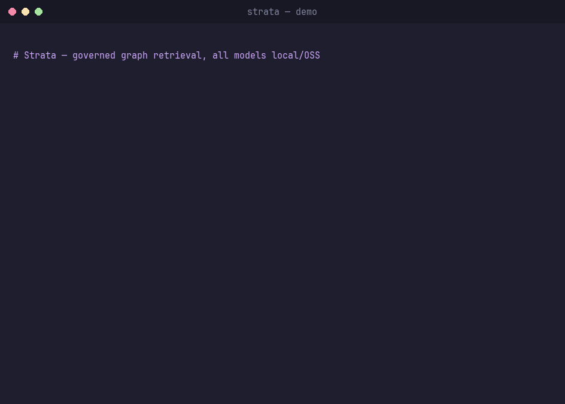

# Strata — 60-second demo

Strata is an agentic GraphRAG assistant whose defining feature is **clearance-aware
retrieval**: a user's clearance is a ceiling (`public < internal < confidential <
restricted`) enforced *inside* the retrieval path. The model never receives a chunk the
caller isn't allowed to read — so it cannot leak it, even by accident.



## Run it yourself

```bash
docker compose up -d && ollama serve & bash scripts/pull_models.sh
uv sync && cp .env.example .env
bash scripts/demo.sh
```

`scripts/demo.sh` seeds the synthetic Acme corpus and walks through the highlights below.

## The highlights

### 1. The ACL boundary (the money shot)

The restricted board memo sets a **$140M FY2026 target** for Acme Robotics. Ask for it
without clearance and Strata refuses — the chunk is filtered in Qdrant *and* Neo4j before
generation, so it never reaches the model:

```bash
uv run strata ask "What is Acme Robotics' restricted revenue target for fiscal year 2026?" --clearance public
# --- Sources (0) ---
# --- Answer ---
# I don't have enough information in the accessible documents to answer that.
```

Raise the clearance and the same question is answered:

```bash
uv run strata ask "What is Acme Robotics' annual revenue target for fiscal year 2026?" --clearance restricted
# ... Acme Robotics has a target of 140 million USD by fiscal year 2026 [1].
```

### 2. Multi-hop graph retrieval

The CFO lives in the finance/board documents; the risks live in the risk register. Strata
expands the knowledge graph from the vector seeds to connect them in one answer:

```bash
uv run strata ask "Who is the CFO of Acme Robotics and which risks affect Acme Corporation?" --clearance restricted
# --- iterations: 1 | elapsed_ms: ... | faithfulness: 1.0 | sufficient: True ---
# Jane Smith is the CFO of Acme Robotics [1]. Acme Corporation is exposed to supply chain
# risk and currency exchange risk [2].
```

### 3. The numbers (quality, measured)

```bash
uv run strata eval        # writes reports/EVAL_METRICS.md + reports/eval_metrics.json
```

Reports, over a versioned golden set on the synthetic corpus:

- **retrieval recall@k**, **answer correctness** (deterministic substring match),
- **ACL-safety** — the share of denial cases where a higher-clearance secret never leaks
  (target **100%**),
- **agent loop vs single-pass** — critic faithfulness, mean iterations, and the latency the
  loop costs.

## Recording the GIF

The GIF is produced from `demo.tape` with [charmbracelet/vhs](https://github.com/charmbracelet/vhs):

```bash
uv run strata seed-demo --reset   # with the stack up
vhs demo.tape                      # -> docs/strata-demo.gif
```

`Sleep` durations in `demo.tape` must exceed each command's runtime; tune them to your
model/GPU speed.
